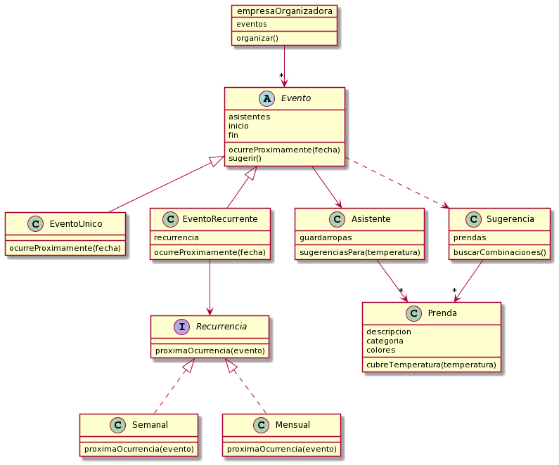

# Enunciado

El enunciado puede leerse en este readme o en [google docs](https://docs.google.com/document/d/1hUGN4koFF5_rvl0rhcd9J6uPDFeAwSPxxPZjGwuE-RA).

## Waza - Noviembre 2021

Una conocida aplicación de mensajería adquirió otra conocida aplicación de navegación. Como en muchas ciudades se está usando esta aplicación para conocer el estado del tránsito en todo momento, nos pidieron ayuda para modelar algunos de sus componentes y desarrollar ciertas funcionalidades.

### A. Usuarios

Los usuarios de esta aplicación cuentan con cierta información: nombre de usuario, dni, y dinero en su cuenta.

Se pide que un usuario pueda recorrer una distancia, lo cual hará haciendo uso de su vehículo asociado. Dado que recorrer distancias consume combustible, un usuario debe poder recargar una determinada cantidad, teniendo en cuenta que:

* El combustible tiene un costo de $40 por litro.
* El usuario debe contar con suficiente dinero en su cuenta para pagar la carga.
* No se puede superar la capacidad del tanque del vehículo1.

Por último, dado que en esta aplicación los usuarios pueden incurrir en infracciones, cada uno tiene un registro con sus multas. Las mismas tienen un costo y se sabe si están pagadas o no. La multa únicamente puede ser pagada si el usuario tiene el dinero suficiente. En caso contrario, al igual que con el combustible, no se podrá pagar.

### B. Vehículos

Los vehículos tienen una capacidad en su tanque, una cantidad de combustible y una velocidad promedio. Al recorrer una determinada distancia en kilómetros todos los vehículos pierden como base 2 litros de combustible.

Existen distintos tipos de vehículos:
* **Camionetas**: Al ser bastante contaminantes no se las considera ecológicas y pierden 4L de base (en vez de 2L) y 5L de combustible adicional por cada kilómetro recorrido.
* **Deportivos**: Se los puede considerar ecológicos a aquellos deportivos que tengan una velocidad promedio menor a 120km/h. Sin importar la distancia que recorran estos vehículos perderán 0.2L adicionales por su velocidad promedio.
* **Familiares**: Son un muy buen vehículo dado que son ecológicos y no tienen una pérdida adicional de combustible cuando recorren una distancia.

### C. Zonas

Las zonas cuentan con una máxima velocidad permitida, conocen a los usuarios que están transitando por ella y tienen un conjunto de controles.

Se pide poder activar los controles de una zona,efectivizando las multas que ocurriesen para cada uno de los usuarios que se encuentren en ella.

Los controles de una zona pueden ser de distinto tipo:
* **De Velocidad**: Si la velocidad promedio del vehículo es mayor que la permitida por la zona, le genera una multa al usuario de $3000.
* **Ecológicos**: Estos controles se sumaron recientemente a la aplicación dada la cantidad de daño que se está generando al medio ambiente. Si el auto no es ecológico se le sumará una multa al usuario de $1500.
* **Regulatorios**: Estos controles aparecieron durante la cuarentena pero siguen presentes hasta el día de hoy. Los días del mes pares sólo los usuarios con dni par pueden moverse, lo mismo para los días impares2. En caso de infringir esta norma se crea una multa de $2000.

### D. La app (aplicación)

Obviamente también tenemos nuestro sistema principal. El cual posee todos los usuarios y todas las zonas. Nuestro sistema debe permitir:

* Pagar multas: la aplicación le va a pedir a los usuarios que paguen sus multas. Un usuario va a pagar las multas que pueda con el dinero que posee en ese momento. Las multas que no puedan ser pagadas aumentaran su costo en un 10% por pago retrasado. Este aumento se dará cada vez que no se puedan pagar.
* Obtener la zona más transitada, es decir, aquella que tenga la mayor cantidad de usuarios.
* Saber qué usuarios son complicados, es decir, aquellos que tienen más de $5000 en multas sin pagar.

#### Notas

1. En caso que queramos cargar 120 litros pero al vehículo solo se le pueda cargar 80 litros, al usuario se le cobrará el valor de 80 litros.
2. Para conseguir el número del día de una fecha podemos hacer new Date().day(). Por ejemplo, si hoy que es 01/11/2021 hacemos new Date().day(), nos devolvería 1

---
## Diagrama de clases

Elegí **una** de las siguientes opciones:

1. Realizar el diagrama de clases de tu solución a este enunciado y subirla junto al código. Subir el diagrama (hecho en `plantuml` o a mano) como una imagen con el nombre **`diagrama_solucion_NOMBRE_APELLIDO`** (con algún formato de imagen común).
2. Explicar el siguiente diagrama de clases en prosa. Ejemplo: *"En este diagrama podemos ver que la clase X hereda de la clase Y, etc."*. Subir la explicación en un archivo de texto (`.txt` o `.md`) con nombre **`explicacion_diagrama_NOMBRE_APELLIDO`**.

